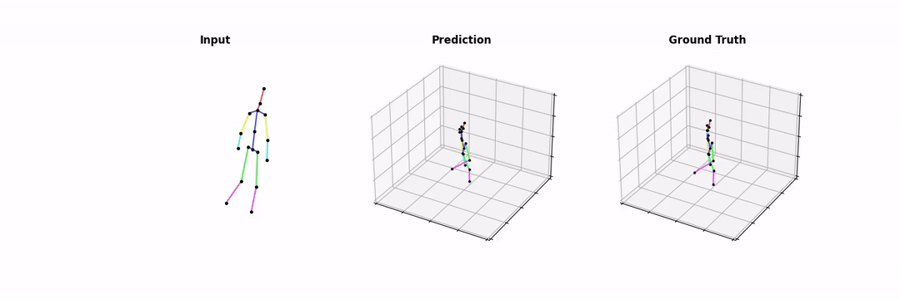

# Uplift and Upsample 3D HPE



This repository is the official implementation
of [Uplift and Upsample: Efficient 3D Human Pose Estimation with Uplifting Transformers](https://arxiv.org/abs/2210.06110)
.

The paper is accepted for [WACV'23](https://wacv2023.thecvf.com).

## Updates

* 2022-12-14: Added code and instructions for AMASS pre-training.
* 2022-12-12: Added training code.
* 2022-12-12: Updated requirements.
* 2022-10-12: Added evalaution code an pre-trained models.

## Dependencies

* Python 3.7+
* tensorflow 2.4+

## Dataset

### Human3.6M

We refer to [VideoPose3D](https://github.com/facebookresearch/VideoPose3D/blob/master/DATASETS.md) for the dataset
setup.
Follow the instructions there to generate the dataset in the common  `.npz` format.
You will need the following generated files:

* `data_2d_h36m_gt.npz`: Ground truth 2D poses.
* `data_2d_h36m_cpn_ft_h36m_dbb.npz`: 2D poses from a fine-tuned [CPN](https://github.com/GengDavid/pytorch-cpn).
* `data_3d_h36m.npz`: Ground truth 3D poses.

Copy all files to the `./data` directory.

### AMASS
In case you want to pre-train your own model on AMASS mocap data, please follow the [dataset setup](./data/DATASET.md).

## Trained Models

### Human3.6M

We provide trained models on Human3.6M for the following settings:

|      Name      |  N  |  s_out  |     s_in      | AMASS pre-training |                       Config                       |                                               Download                                                |
|:--------------:|:---:|:-------:|:-------------:|:------------------:|:--------------------------------------------------:|:-----------------------------------------------------------------------------------------------------:|
|  h36m_351.h5   | 351 |    5    |  {5, 10, 20}  |                    |    [config/h36m_351.json](config/h36m_351.json)    |  [Google Drive](https://drive.google.com/file/d/1tzDf2IiTQDmsHiNQLmrPlFwN4arGUORa/view?usp=sharing)   |
| h36m_351_pt.h5 | 351 |    5    |  {5, 10, 20}  |        Yes         | [config/h36m_351_pt.json](config/h36m_351_pt.json) |  [Google Drive](https://drive.google.com/file/d/1pVGmA5x23y-cmRfntbkWJIODv_yNqHfJ/view?usp=sharing)   |
|   h36m_81.h5   | 81  |    2    |  {4, 10, 20}  |                    | [config/h36m_81.json](config/h36m_81.json)         |    [Google Drive](https://drive.google.com/file/d/1Gba54Tf86YNEhSkLEl48miJvzWy8HQS3/view?usp=sharing) |

Copy any trained model to the `./models` directory.

The models achieve the following MPJPE (all frames, in mm) on Human 3.6M:

|      Name      | s_in = 4 | s_in = 5 | s_in = 10 | s_in = 20 |
|:--------------:|:--------:|:--------:|:---------:|:---------:|
|  h36m_351.h5   |    X     |   45.7   |   46.1    |   47.8    |
| h36m_351_pt.h5 |    X     |   42.6   |   43.1    |   45.0    |
|   h36m_81.h5   |   47.4   |    X     |   47.9    |   49.9    |

### AMASS

We also provide a pre-trained model on AMASS mocap data with the following setting:

|     Name     |  N  |  s_out  |     s_in      |                     Config                     |                                               Download                                                |
|:------------:|:---:|:-------:|:-------------:|:----------------------------------------------:|:-----------------------------------------------------------------------------------------------------:|
| amass_351.h5 | 351 |    5    |  {5, 10, 20}  | [config/amass_351.json](config/amass_351.json) |  [Google Drive](https://drive.google.com/file/d/14-RddCHE8hngwbSNobd4IEuxLZNM52rg/view?usp=sharing)   |

Copy this pre-trained model to the `./models` directory as well.

## Evaluation

You can run evaluation on Human3.6M for our pre-trained models with the `eval.py` script:

```bash
python eval.py --weights ./models/XXX.h5  --config ./config/XXX.json
```

where `./models/XXX.h5` is the path to the model weights and `./config/XXX.json` is the path to the model configuration.
By default, evaluation is run for all values of **s_in** that were used during training.
You can limit evaluation to one specific **s_in** value with the `--forced_mask_stride <value>` switch.
If the pre-defined batch size for evaluation is too large for your GPU, you can manually lower it with
the `--batch_size <value>` switch.

## Training

### Human3.6M

You can train the models on Human3.6M yourself with the `train.py` script:

```bash
python train.py --train_subset trainval --val_subset none --test_subset test [ARGS]
```

Please see the table below for the correct additional `ARGS`:

|                       Config                       | AMASS pre-training |                                              `ARGS`                                               |
|:--------------------------------------------------:|--------------------|:-------------------------------------------------------------------------------------------------:|
|    [config/h36m_351.json](config/h36m_351.json)    |                    |                    `--config ./config/h36m_351.json --out_dir ./logs/h36m_351`                    |
| [config/h36m_351_pt.json](config/h36m_351_pt.json) | Yes                | `--config ./config/h36m_351_pt.json --weights ./models/amass_351.h5 --out_dir ./logs/h36m_351_pt` |
|     [config/h36m_81.json](config/h36m_81.json)     |                    |                     `--config ./config/h36m_81.json --out_dir ./logs/h36m_81`                     |

Logs, checkpoints, etc. will be stored in the specified `./logs/xxx` directory.

### AMASS

If you want you can pre-train your own model on AMASS mocap data. 
We provide instructions to run the pre-training used for [config/h36m_351_pt.json](config/h36m_351_pt.json).

Make sure to follow the AMASS [dataset setup](./data/DATASET.md). Pre-training on AMASS can be run with the same `train.py` script:

```bash
python train.py --dataset amass --amass_path ./data/amass --test_subset none  --config ./config/amass_351.json  --out_dir ./logs/amass_351
```

## Citation

In case this work is useful for your research, please consider citing:

    @InProceedings{einfalt_up3dhpe_WACV23,
    title={Uplift and Upsample: Efficient 3D Human Pose Estimation with Uplifting Transformers},
    author={Einfalt, Moritz and Ludwig, Katja and Lienhart, Rainer},
    booktitle = {Proceedings of the IEEE/CVF Winter Conference on Applications of Computer Vision (WACV)},
    month     = {January},
    year      = {2023},
    }

## Acknowledgments

Our code is heavily influenced by the following projects:

* [VideoPose3D](https://github.com/facebookresearch/VideoPose3D)
* [PoseFormer](https://github.com/zczcwh/PoseFormer)
* [StridedTransformer](https://github.com/Vegetebird/StridedTransformer-Pose3D)

We are grateful to the corresponding authors for releasing their code.
